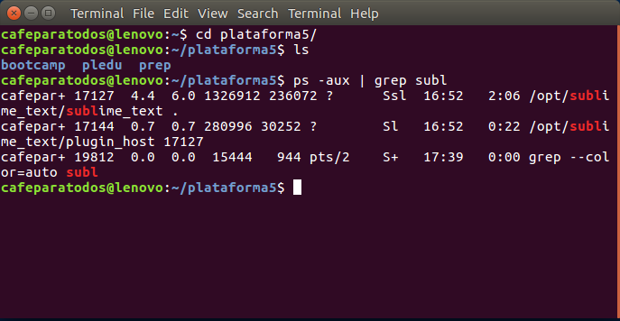
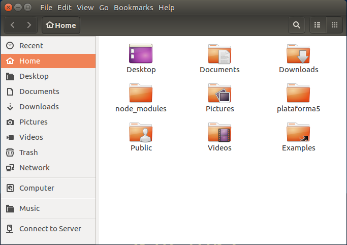
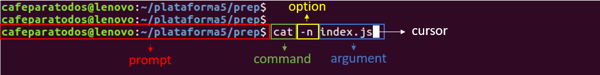

# Command Line Interface

### Teoria Introductoria

Un _**CLI**_ o _**interfaz de línea de comandos**_ es una interfaz basada en texto que le permite al usuario interactuar con el sistema operativo.

El programa que maneja esa interacción se le llama **emulador de terminal** (**command language interpreter**) o **shell**.

Las CLI pueden usarse de modo interactiva, escribiendo instrucciones en una entrada de texto, o pueden utilizarse de una forma automatizada leyendo órdenes desde un archivo de scripts.



Esta no es la única interfaz que conocemos, de hecho es la que menos conocemos, la mas usada se llama GUI (_Graphic user interface_) y es el modelo que usa casi todo el software que usamos.

Se compone de una ventana con iconos, botones y menús que te permiten navegar de manera _intuitiva_ y sin _conocimientos previos_.



#### CLI vs GUI

A pesar de las ventajas que pueda traer un GUI es muy importante el manejo de interfaces basadas en texto (CLI), porque es la mejor manera de trabajar con la mayoría de los programas y de la manera mas eficiente.

Algunas de sus ventajas son:

  * _**Velocidad**_: Una vez familiarizado con los comandos y el flujo de trabajo, la velocidad de acción es notoriamente superior a la de un GUI.
  * _**Menos recursos**_: Un CLI utiliza menos recursos para operar que un interfaz gráfica y permite un uso optimizado de la PC.
  * _**Pocos cambios**_: La interfaz gráfica de los programas suele cambiar mucho en poco tiempo y tenemos que estar acostumbrándonos a los nuevos UI con cada versión, en cambio un CLI no suele cambiar y en caso de que si, suele ser solo para agregar una nueva funcionalidad.
  * _**Poderosos**_: Se pueden correr scripts que realicen muchas acciones a la vez.


### Anatomía de un comando

Un comando esta formado por varias partes:



* __*Prompt*__ : Da información del entorno bajo el que estas trabajando e indica que el shell(terminal) esta listo para recibir un nuevo comando.

  > en el bash de los sistemas UNIX se usa el signo $

  > en el CMD de Windows se usa el signo >

* __*Command Name*__ : Es lógicamente el nombre propio del comando que vamos a usar, es único y es como el CLI va a reconocer que buscamos hacer. Es el que encabeza el comando.

* __*Flags u Options*__ : Son configuraciones extra que le vamos a dar a nuestro comando, empiezan siempre con uno o dos guiones medios (-) y luego una letra o palabra que represente la opción especifica que queremos activar. Puede ir tanto antes como después del argumento.

* __*Argument*__ Es el parámetro al que queremos hacer referencia con nuestro comando. Puede ser mas de uno separados por espacios en blanco.

Por ejemplo 

``` bash
$ cd javascript  // command + argument

$ ls -a  // command + option

$ rm -r exampleFolder  // command + option + argument
```

### Poniendo en practica

#### Accediendo a la terminal

Ahora vamos a ver un poco como acceder al **shell**,

Si estamos en Linux podemos abrir el prompt de búsqueda y escribimos **terminal**, dependiendo en tu distro puede variar, entre la tecla súper o súper + space

> Ubuntu y Mint (entre otros) te permite entrar con el shortcut Ctrl + Alt + T

Estando en MacOS Ctrl+Space para abrir el prompt de búsqueda y escribimos **terminal**

Ahora podemos pasar al siguiente topic y empezar a trabajar.
