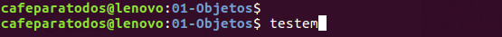
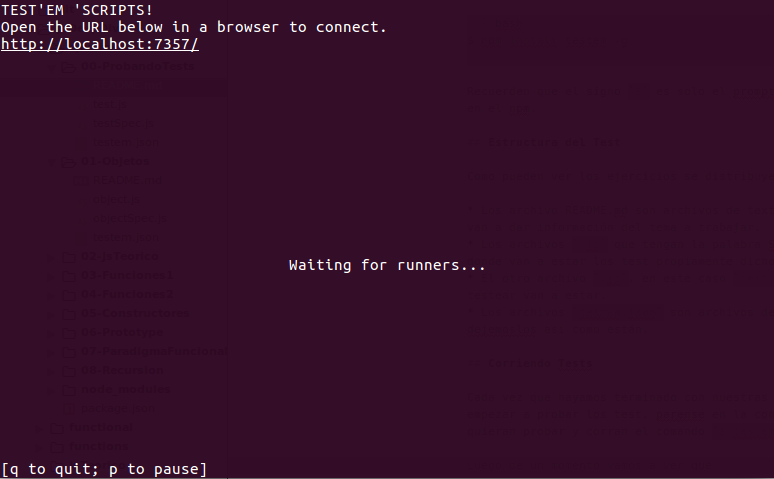

## ¿Que es un test?

Un test es un programa que valida que algún otro programa o script realice las acciones que debería hacer.

Constantemente estamos probando si nuestro código funciona como debería de manera manual, la idea de un test es que se realicen automáticamente y a partir de ellos poder modificar o agrandar nuestra trabajo sin arruinar las funcionalidades que ya estaban implementadas.

> Siempre que hagamos un test vamos a buscar la operación mas pequeña o básica de cada función y asegurarnos que la cumpla.

Un test manual podría ser del estilo:

``` javascript
// Dada la siguiente función
function suma(a, b) {
  return a + b;
}

// TEST:
// Ejecutando suma con `1` y `2` como argumento
var result = suma(1, 2);

// el resultado debería ser 3
console.log(result === 3)
```

Pero lógicamente no vamos a tener que hacer todo el trabajo nosotros, porque se imaginan que cuando las cosas se compliquen los test no van a ser tan fáciles.

Vamos a usar un framework de testing que nos va a facilitar la estructuración de los test y agrega una visualización mas amigable de los resultados.

## Preparación

Para correr los test a lo largo del prep vamos a necesitar instalar un par de programas que nos van a acompañar a lo largo del Js-preparation.

### NodeJS

Node es un motor de JavaScript que nos va a permitir correrlo fuera del browser, por ahora no se preocupen mucho por que hace, lo vamos a ver mas adelante.

Para instalar Node vamos a ir a su [pagina](https://nodejs.org/en/) y seguir las instrucciones según el sistema operativo que estés usando.

### Npm

Npm es un servicio de paquetes que nos va a permitir usar código de otras personas, al igual que Node no vamos a entrar más en detalle todavía.

Este servicio viene incluido en NodeJS.

### Testem

Testem es una pequeña librería de testeo que nos va a permitir validar fácilmente y de manera dinámica si un programa hace lo que esperamos.

para instalarlo vamos a entrar en la consola correr el comando:

``` bash
$ npm install testem -g
```

Recuerden que el signo `$` es solo el prompt de su consola, el comando empieza en el npm.

## Archivos del Test

Como pueden ver los ejercicios se distribuyen en 4 archivos.

* Los archivo README.md son archivos de texto o mejor dicho _markdown_ que nos van a dar información del tema a trabajar.
* Los archivos `.js` que tengan la palabra Spec, en este caso `testSpec.js` es donde van a estar los test propiamente dichos.
* El otro archivo `.js`, en este caso `test.js` es donde las funciones a testear van a estar.
* Los archivos `testem.json` son archivos de configuración para el test, dejemoslos así como están.

## Estructura del Test

Los tests están encerrados dentro de unos bloques de nombre __*describe*__, que sirven para dar contexto a lo que se testeara ahí dentro.

El test propiamente dicho lo declaramos en la función __*it*__, especificando que se va a testear en cada oportunidad.

La operación a comprobar, que da la naturaleza de test, esta en los __*expect*__

## Corriendo Tests

Cada vez que hayamos terminado con nuestras funciones, o cuando quieran empezar a probar los test, párense en la consola, justo en la carpeta que quieran probar y corran el comando `$ testem`.



Luego de un momento vamos a ver que `Waiting for runners...` aparece en nuestra pantalla, eso significa que ya tenemos el servicio de testem corriendo y lo podemos acceder entrando a `localhost:7357`. 



Una vez que todas sus funciones estén bien testeadas pueden seguir adelante con los ejercicios.
